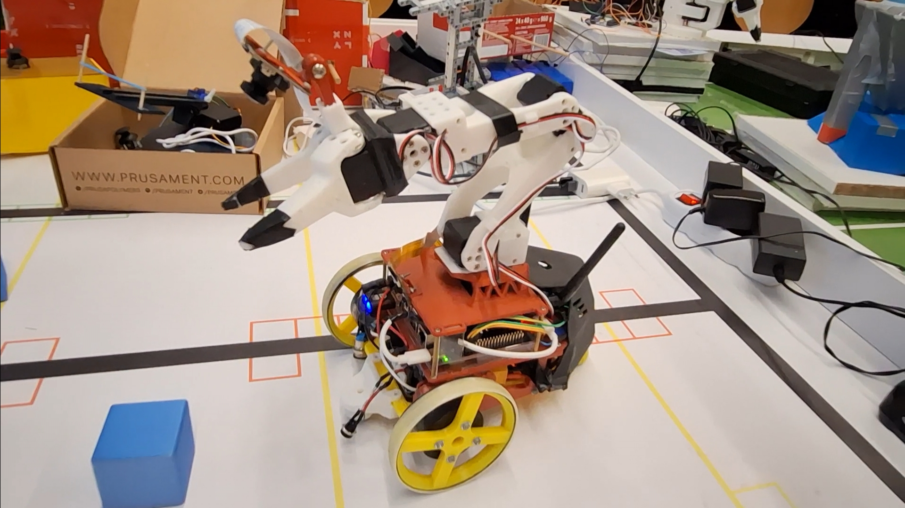

# JetsonBot Software Setup

This guide explains how to set up the JetsonBot software environment, configure the Jetson Orin Nano, install LeRobot, install the JetsonBot libraries, calibrate the robot arm, and run teleoperation, recording, and policy evaluation.

---

## Requirements

You will need:

- printed parts from onshape document
```text
https://cad.onshape.com/documents/1c027469138e22df9abe4045/w/c7a37744e0032bf1c17d6366/e/4006b5648b1eac5f03fa06ec?renderMode=0&uiState=6a1c07ff284022db124a85fb
```
- [waveshare 3s ups module](https://www.waveshare.com/wiki/UPS_Module_3S)
- esp32 30pin version
- MPU6050
- 4 [Feetech ST3215](https://www.seeedstudio.com/Feetech-ST-3215-C044-Heavy-Duty-Servo-7-4V-1-191-Gear-Reduction-p-6460.html?srsltid=AfmBOoqBVjSrcsUERWT7MoxU_r9qsv71-_3SjrbNKbMuXd1zaGxcTlCi) servos of your choosing (you'll need step-down for the 7.4v version)
- acrylic case for the jetson
- 2 AS5600 magnetic encoders with magnets
- [serial convertor](https://www.seeedstudio.com/Bus-Servo-Driver-Board-for-XIAO-p-6413.html) for the STS servos 
- a hell lot of screws and nuts M2 and M3
- 3 Li-Ion 18650 batteries
- 2 [simple foc mini](https://docs.simplefoc.com/simplefocmini) drivers
- 2 balls with 20mm diameter for the omniwheels
- 2 [GM4108 motors](https://shop.iflight.com/ipower-motor-gm4108h-120t-brushless-gimbal-motor-pro217)
- A PC running Linux
- NVIDIA Jetson Orin Nano
- Ubuntu with JetPack 6.2 installed on the Jetson
- CSI cameras, for example:
  - IMX477
  - IMX219
- SO101 Leader arm connected to the client PC
- JetsonBot follower arm connected to the Jetson
- Gamepad connected to the client PC
- Both devices connected to the same local network or VPN

Since the Jetson will usually run without an HDMI cable, the setup assumes that it will be accessed remotely from your Linux PC.

---

## 1. Build

Print and bou all the mentioned parts above.

Putting it together is fairly simple, you can follow the assembly in the onshape document mentioned above.

Don't forget to print adapters to the motor hollow shaft for your magnet size and put encoders in their slot

### Wiring

so you have qiute a lot of devices, you have to wire.

- ESP32
- 2x AS5600
- 2x Simple foc mini
- MPU6050
- Jetson
- UPS

First connect both AS5600
GND - GND on UPS
VCC - 3.3V on UPS

Left AS5600
SDA - ESP GPIO 21
SCL - ESP GPIO 22

right AS5600
SDA - ESP GPIO 19
SCL - ESP GPIO 23

Now connect the Simple FOC minis
VCC - UPS 12.6V out
GND - UPS GND
GND - ESP GND
M1, M2, M3 - Motor phases (switching any pair reverses the direction)

Left Simple FOC
In1 - ESP GPIO 13
In2 - ESP GPIO 12
In3 - ESP GPIO 14
EN - ESP GPIO 5

Right Simple FOC
In1 - ESP GPIO 33
In2 - ESP GPIO 25
In3 - ESP GPIO 26
EN - ESP GPIO 18

Now connecting ESP to Jetson
ESP GPIO 16 (RX) - Jetson pin 8 (TX)
ESP GPIO 17 (TX) - Jetson pin 10 (RX)
ESP GND - Jetson GND (pin 6)

For connecting together UPS MPU and Jetson
UPS 5V - MPU VCC
UPS GND - MPU GND - Jetson GND
UPS SCL - MPU SCL - Jetson pin 5 (SCL)
UPS SDA - MPU SDA - Jetson pin 3 (SDA)
UPS 12.6V - Jetson 12.6V in (the round connector in the front)

---

## 2. Jetson Initial Setup

Install Ubuntu with JetPack 6.2 on the Jetson Orin Nano.

Follow the official NVIDIA setup guide:

```text
https://www.jetson-ai-lab.com/tutorials/initial-setup-jetson-orin-nano/
```

After the Jetson is set up, connect the CSI cameras to the CSI ports.

Then run the Jetson IO configuration tool:

```bash
sudo python /opt/nvidia/jetson-io/jetson-io.py
```

Configure the 24-pin CSI ports according to the cameras you are using.

If needed, you can follow this video tutorial:

```text
https://www.youtube.com/watch?v=gJPIJ3yxME0
```

---

## 3. Install LeRobot

Install LeRobot by following the official guide:

```text
https://huggingface.co/docs/lerobot/installation
```

After installing LeRobot, enable the required extra features:

```bash
cd lerobot

pip install 'lerobot[feetech]'
pip install 'lerobot[lekiwi]'
```

---

## 4. Install JetsonBot Libraries

The following steps must be done on both the Jetson and the client PC.

Activate the LeRobot environment:

```bash
conda activate lerobot
```

Clone the JetsonBot repository:

```bash
git clone https://github.com/Bobik128/jetson-bot.git
```

Install the JetsonBot robot package:

```bash
cd jetson-bot/src/lerobot_robot_jetsonbot

pip install -e .
pip install lerobot_robot_jetsonbot
```

Install the DualSense teleoperator package:

```bash
cd ../lerobot_teleoperator_dualsense

pip install -e .
pip install lerobot_teleoperator_dualsense
```

---

## 5. Apply LeRobot Patches on the Jetson

On the Jetson, patches need to be applied to the LeRobot library so that JetsonBot is available as a robot type.

Go to the LeRobot repository:

```bash
cd ../lerobot
```

Check the patches first:

```bash
git apply --check ../jetson-bot/'lerobot-modifiing patches'/lerobot_record.patch
git apply --check ../jetson-bot/'lerobot-modifiing patches'/lerobot_setup_motors.patch
```

Apply the patches:

```bash
git apply ../jetson-bot/'lerobot-modifiing patches'/lerobot_record.patch
git apply ../jetson-bot/'lerobot-modifiing patches'/lerobot_setup_motors.patch
```

---

## 6. Connect the Robot Arm to the Jetson

Connect the robot arm serial bus driver board to a USB port on the Jetson.

Then find the correct USB port:

```bash
lerobot-find-port
```

When prompted, disconnect the MotorBus USB cable and press Enter.

Example output:

```text
Finding all available ports for the MotorBus.
['/dev/ttyACM0', '/dev/ttyACM1']

Remove the USB cable from your MotorBus and press Enter when done.

[...Disconnect the corresponding leader or follower arm and press Enter...]

The port of this MotorBus is /dev/ttyACM1

Reconnect the USB cable.
```

In this example, the correct port is:

```text
/dev/ttyACM1
```

On Linux, you may need to give access to the USB ports:

```bash
sudo chmod 666 /dev/ttyACM0
sudo chmod 666 /dev/ttyACM1
```

---

## 7. Set Up Motor IDs

Run the motor setup command:

```bash
lerobot-setup-motors \
    --robot.type=jetsonbot \
    --robot.port=/dev/ttyACM1
```

Replace `/dev/ttyACM1` with the port found in the previous step.

Follow the instructions printed by the program.

---

## 8. Calibrate Motor Limits

After setting up the motor IDs, calibrate the robot:

```bash
lerobot-calibrate \
    --robot.type=jetsonbot \
    --robot.port=/dev/ttyACM1 \
    --robot.id=jetson-bot
```

Replace `/dev/ttyACM1` with the correct port for your robot.

This process is technically the same as calibrating an SO101 follower arm.

After this step, the base software setup is complete.

---

## 9. Test Teleoperation

To test the setup, connect the SO101 Leader arm and a gamepad to the client PC.

On the Jetson, run the host script:

```bash
bash jetson-bot/runners/run_jetson_host.sh
```

On the client PC, edit:

```text
jetson-bot/src/scripts/teleoperate.py
```

Set the Jetson IP address:

```python
remote_ip = "10.102.180.119"
```

Replace the example IP address with the actual IP address of your Jetson.

Also set the SO101 Leader arm ID:

```python
leader_id = "the_leader"
```

Replace `the_leader` with your actual leader arm ID.

Then run teleoperation from the client PC:

```bash
python3 jetson-bot/src/scripts/teleoperate.py
```

A window with camera feeds and joint feedback should appear.

The robot should now react to the SO101 Leader arm and the gamepad.

---

## 10. Recording Datasets

The `record.py` script works similarly to `teleoperate.py`.

Before recording, make sure you are logged in to your Hugging Face account.

The gamepad buttons are bound to actions such as:

- Stop recording
- Re-record an episode
- Exit early
- Control the recording flow

These bindings can be configured inside the `record.py` file.

Recorded datasets are automatically uploaded to the LeRobot Hub.

---

## 11. Training a Policy

To train a policy, use the `lerobot-train` script.

Follow the official LeRobot training documentation:

```text
https://huggingface.co/docs/lerobot/
```

For this robot, it is recommended to train only the ACT policy.

Other policies are generally too heavy for the Jetson and may not run properly during evaluation.

---

## 12. Policy Evaluation

Evaluation runners are located in:

```text
jetson-bot/runners
```

Before running evaluation, update the runner scripts with:

- Jetson IP address
- Hugging Face model link
- Evaluation dataset name
- Other required evaluation settings

Then run the appropriate evaluation runner from the `runners` folder.

---

## Notes

- The Jetson and client PC must be on the same local network or connected through a VPN.
- Always check that the correct USB port is used before running setup, calibration, or teleoperation.
- If USB permission errors occur, run:

```bash
sudo chmod 666 /dev/ttyACM0
sudo chmod 666 /dev/ttyACM1
```

- The camera configuration must match the cameras connected to the CSI ports.
- If teleoperation starts but the robot does not move, check:
  - The Jetson host script is running
  - The correct remote IP is set
  - The correct leader arm ID is set
  - The robot arm is connected to the Jetson
  - The gamepad is connected to the client PC
